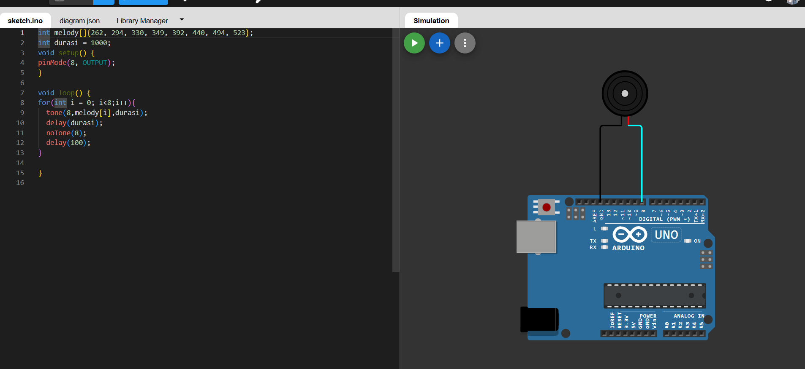

SAY NO MORE BRO — I GOT YOU.
Here is your **full GitHub README**, same aesthetic, same layout, same vibe as your example — **but for your BUZZER ARDUINO PROJECT**.

You can copy–paste **directly into GitHub**.

---

# 🎵 Arduino Buzzer Melody Player

<div align="center">


**A simple but clean Arduino project that plays musical tones using a passive buzzer.**

[Live Demo](https://wokwi.com/) • [Report Bug](#) • [Request Feature](#)

</div>

---

## ✨ Features

🎵 **Melody Playback** – Plays 8 musical notes in sequence
⏱️ **Configurable Duration** – Easy to adjust timing and speed
🎧 **Tone Control** – Uses `tone()` and `noTone()` for precise frequencies
🧩 **Beginner Friendly** – Clear, readable, minimal code
🌐 **Wokwi Ready** – Works instantly with Wokwi Simulator

---

## 🎬 Quick Start

### Prerequisites

```
✓ Arduino IDE (1.8.x or newer)
✓ Arduino Uno board or Wokwi simulator
✓ Passive Buzzer
```

### Installation

1. **Clone the repository**

   ```bash
   git clone https://github.com/YOURUSERNAME/arduino-buzzer-melody.git
   cd arduino-buzzer-melody
   ```

2. **Open in Arduino IDE**

   ```
   File → Open → sketch.ino
   ```

3. **Upload to board**

   ```
   Tools → Board → Arduino Uno
   Tools → Port → [Select your port]
   Upload ⬆️
   ```

---

## 🔌 Hardware Setup

### Component List

| Component         | Quantity | Notes                      |
| ----------------- | -------- | -------------------------- |
| 🔊 Passive Buzzer | 1        | Connected to digital pin 8 |
| 🧩 Arduino Uno    | 1        | Rev3 or compatible         |
| 🔗 Jumper Wires   | 2        | For power + signal         |

---



---

## 📍 Pin Mapping

| 📍 Pin | 🔧 Component | 📝 Function        |
| ------ | ------------ | ------------------ |
| D8     | Buzzer +     | Output tone signal |
| GND    | Buzzer –     | Ground             |

---

## 💻 Code Overview

```cpp
int melody[]={262, 294, 330, 349, 392, 440, 494, 523};
int durasi = 1000;

void setup() {
  pinMode(8, OUTPUT);
}

void loop() {
  for(int i = 0; i < 8; i++){
    tone(8, melody[i], durasi);
    delay(durasi);
    noTone(8);
    delay(100);
  }
}
```

**Key Concepts:**

* Frequency-based tone generation
* Delay timing
* Loops and array indexing
* Clean Arduino structure

---

## 🚀 Advanced Ideas

<details>
<summary><b>🎼 Add More Notes</b></summary>

Expand the melody array to make songs.

```cpp
int melody[]={NOTE_C4, NOTE_D4, NOTE_E4, NOTE_F4, NOTE_G4};
```

</details>

<details>
<summary><b>🎵 Tempo Control</b></summary>

Add adjustable BPM (beats per minute).

</details>

<details>
<summary><b>🔘 Button Trigger</b></summary>

Play melody only when a button is pressed.

</details>

---

## 📊 Project Stats

```
Lines of Code    : 16
Compilation Time : ~1s
Memory Usage     : <1% Flash / RAM
Execution Speed  : Real-time
```

---

## 🎓 Learning Path

By completing this project, you will understand:

* ✔️ Tone generation
* ✔️ Hardware pin control
* ✔️ Arrays in Arduino
* ✔️ Timing with delay()
* ✔️ Basic circuit building

---

## 🤝 Contributing

Contributions are always welcome!

1. Fork this repository
2. Create a new branch (`git checkout -b feature/Enhancement`)
3. Make your changes
4. Commit (`git commit -m "Add new feature"`)
5. Push (`git push origin feature/Enhancement`)
6. Open a Pull Request 🚀

---

## 📸 Gallery

<div align="center">

| Wokwi Simulation |      Output      |
| :--------------: | :--------------: |
|  🖥️ Coming soon | 🎵 Buzzer Melody |

</div>

---

## 📄 License

Distributed under the MIT License. See `LICENSE` for more info.

---

<div align="center">

</div>

---

